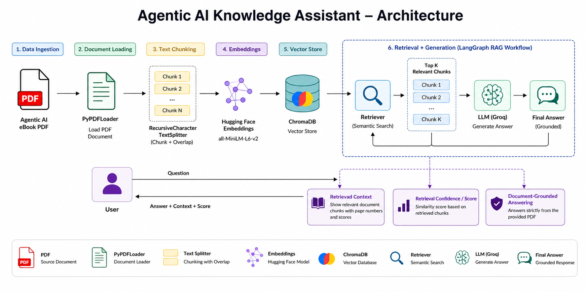

# 🤖 Appening AI Knowledge Assistant
RAG-based Agentic AI Knowledge Assistant built with LangGraph, ChromaDB, embeddings, and LLMs to answer questions strictly from the Agentic AI eBook, with retrieved context and confidence scores through a Streamlit chat interface.

<h2 align="center">🚀 Live Demo</h2>

  

## Features

- PDF document ingestion
- Text chunking with overlap
- Hugging Face sentence embeddings
- ChromaDB vector store
- Semantic retrieval
- LangGraph RAG workflow
- Groq LLM
- Streamlit UI
- Retrieved context chunks
- Retrieval confidence/score
- Document-grounded answers
- Refuses questions that are not supported by the PDF

## Architecture

  

## RAG Workflow

1. Load the Agentic AI eBook PDF from the `data/` directory.
2. Split the document into smaller chunks.
3. Generate embeddings using `sentence-transformers/all-MiniLM-L6-v2`.
4. Store the embeddings in ChromaDB.
5. Retrieve the most relevant chunks for the user's question.
6. Pass the retrieved context to the Groq LLM.
7. Generate an answer strictly from the retrieved context.
8. Return:
   - Final answer
   - Retrieved context chunks
   - Retrieval confidence/score
9. If the required information is not supported by the document, return:

    I don't know based on the provided document.

## Project Structure

    Appening-AI-RAG-Chatbot/
    │
    ├── data/
    │   └── Ebook-Agentic-AI.pdf
    │
    ├── modules/
    │   ├── config.py
    │   ├── loader.py
    │   ├── splitter.py
    │   ├── embeddings.py
    │   ├── vectorstore.py
    │   ├── retriever.py
    │   ├── llm.py
    │   ├── prompts.py
    │   └── graph.py
    │
    ├── app.py
    ├── streamlit.py
    ├── requirements.txt
    ├── .env
    └── README.md

## Technologies

- Python
- LangChain
- LangGraph
- ChromaDB
- Hugging Face Embeddings
- Groq
- Streamlit
- PyPDFLoader

## Configuration

Create a `.env` file in the project root:

    GROQ_API_KEY=your_groq_api_key

Application configuration:

    GROQ_MODEL=llama-3.3-70b-versatile
    EMBEDDING_MODEL=sentence-transformers/all-MiniLM-L6-v2
    CHUNK_SIZE=1200
    CHUNK_OVERLAP=200
    TOP_K=8

## Installation

    pip install -r requirements.txt

Place the Agentic AI eBook inside:

    data/Ebook-Agentic-AI.pdf

Add your Groq API key:

    GROQ_API_KEY=your_groq_api_key

## Run

    streamlit run streamlit.py

## Example Questions
- What is Agentic AI?
- What are the main goals of Agentic AI?
- How does Agentic AI stand apart from other AI?
- What are the different types of Agentic AI?
- What are the capabilities of Agentic AI?
- What are the benefits of Agentic AI?
- What are the key components of an Agentic AI system?
- What are the types of atomic agents?
- What is a Multi-Agent System?
- What are the roles of the Multi-Agent System for Sales Forecasting?
- What are the practical applications of Agentic AI?

## Example Out-of-Document Question
Question:

    Explain the three laws of Newton.

Answer:

    I don't know based on the provided document.

## Response Format

Every response provides:

    Final Answer
          ↓
    Retrieved Context Chunks
          ↓
    Retrieval Confidence / Score

## Grounded Answering

The assistant is designed to answer questions using only information retrieved from the Agentic AI eBook.

The retrieved context is displayed to the user so they can see the document content used for the answer.

If the document does not contain enough information to answer the question, the assistant does not use unrelated general knowledge.

Instead, it returns:

    I don't know based on the provided document.

## LangGraph Workflow

The RAG pipeline contains two main nodes.

### Retrieve Node

The retrieve node:

- Receives the user's question
- Searches the ChromaDB vector store
- Retrieves relevant document chunks
- Combines the chunks into context

### Generate Node

The generate node:

- Receives the question
- Receives the retrieved context
- Sends both to the Groq LLM
- Generates the final grounded answer

    User Question
          ↓
       Retrieve
          ↓
    Relevant Chunks
          ↓
        Context
          ↓
       Groq LLM
          ↓
     Final Answer

## Vector Retrieval

The application retrieves the top matching chunks from ChromaDB.

    db.as_retriever(
        search_kwargs={"k": TOP_K}
    )

Current configuration:

    TOP_K = 8

## Retrieval Confidence

The application displays a retrieval score/confidence based on the similarity of the retrieved chunks.

A stronger similarity means the retrieved context is more relevant to the question.

    Higher relevance
          ↓
    Better retrieved context
          ↓
    More reliable grounded answer

## Retrieved Context

The application displays the retrieved chunks under:

    📚 Retrieved Context

Each retrieved chunk can contain:

- PDF name
- Page number
- Chunk content
- Retrieval distance/score

This allows the user to inspect the document context used by the RAG pipeline.

## Example

Question:

    What are the roles of the Multi-Agent System for Sales Forecasting?

Answer:

    1. Data Collection Agent
       Gathers sales and customer data.

    2. Data Processing Agent
       Cleans, transforms, and processes raw data.

    3. Sales Prediction Agent
       Uses machine learning models to forecast sales.

    4. Orchestrator Verification Agent
       Validates data integrity and forecast accuracy.

    5. Report Generation Agent
       Creates actionable reports and dashboards.

Retrieved Context:

    Page 42
    Page 43

Retrieval Confidence:

    0.57

## Project Goal

The goal of this project is to build a document-grounded AI assistant that can:

- Understand the provided Agentic AI eBook
- Retrieve relevant information from the PDF
- Generate accurate answers from retrieved context
- Show the retrieved context
- Show retrieval confidence/score
- Avoid answering questions outside the document

## Complete Pipeline

    PDF
     ↓
    PyPDFLoader
     ↓
    RecursiveCharacterTextSplitter
     ↓
    Hugging Face Embeddings
     ↓
    ChromaDB
     ↓
    Retriever
     ↓
    LangGraph
     ↓
    Groq LLM
     ↓
    Final Answer
     ↓
    Retrieved Context + Confidence Score
